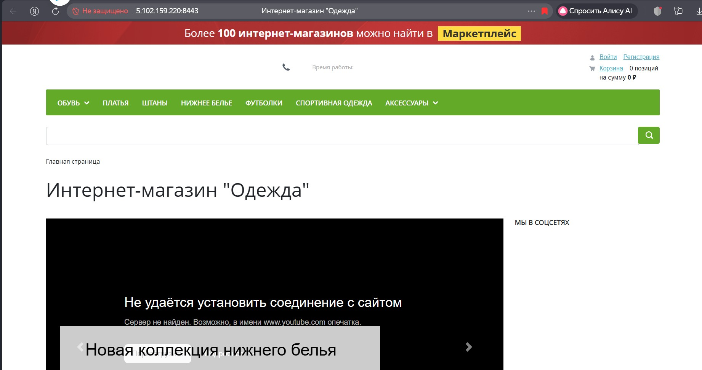

# BITRIX-FOR-RASPBERY-PI

## О проекте
Создание полностью изолированного тестового стенда на базе Raspberry Pi для диагностики критической ошибки интеграции интернет-магазина на 1С-Битрикс с эквайрингом Газпромбанка (СПЭК, модуль `pgamerchant`).
Проект включает развертывание сервера, настройку сети, контейнеризацию, установку CMS и глубокий анализ кода платежного модуля для исправления ошибки `Wrong signature`.

## 🚀 Возможности
- **Полноценный сервер на Raspberry Pi** с белым статическим IP (5.102.159.220) и доменом (tda-photo.ru)
- **Контейнеризация через Docker**: изолированная среда с Apache + PHP 8.2 + MySQL 8.0 для 1С-Битрикс
- **Развертывание 1С-Битрикс** (редакция «Бизнес») с демо-магазином
- **Интеграция платежного модуля `pgamerchant`** (Газпромбанк, СПЭК): настройка параметров, callback-уведомлений, работа с PEM-сертификатами
- **Диагностика ошибки `Wrong signature`**:
  - Статический анализ кода модуля
  - Выявлена причина: использование `$_SERVER['SERVER_NAME']` вместо `$_SERVER['HTTP_HOST']`
  - Найдено устаревшее использование `OPENSSL_ALGO_SHA1` вместо `SHA256`
- **Разработка диагностических скриптов** (`cert_test.php`, `host_test.php`, `callback_test.php`)
- **Настройка сетевой инфраструктуры**: NAT, проброс портов (8443), Hairpin NAT

## 🛠 Технологии
- **Аппаратная платформа:** Raspberry Pi 4 (4GB RAM), Raspberry Pi OS
- **Виртуализация:** Docker, Docker Compose
- **Стек:** PHP 8.2, Apache, MySQL 8.0, Nginx
- **CMS:** 1С-Битрикс: Управление сайтом (Бизнес)
- **Платежи:** Модуль pgamerchant (Газпромбанк, СПЭК)
- **Криптография:** OpenSSL, X.509, PEM
- **Сети:** TCP/IP, NAT, DNS, Port forwarding
- **Диагностика:** Wireshark, cURL, strace, tcpdump

## Скриншоты

## Установка и запуск
# 1. Клонировать репозиторий
git clone https://github.com/IOXNSUN/BITRIX-FOR-RASPBERY-PI.git
cd BITRIX-FOR-RASPBERY-PI

# 2. Запустить контейнеры
docker compose up -d

# 3. Установить Битрикс через браузер
# Открыть http://5.102.*** и следовать инструкциям

# 4. Установить модуль pgamerchant
# Скопировать модуль в /bitrix/modules/ и установить через админку
